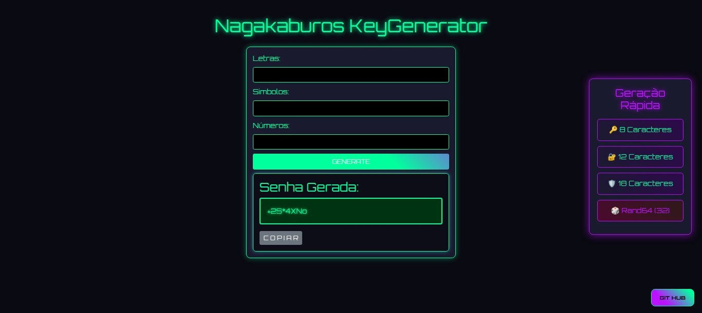
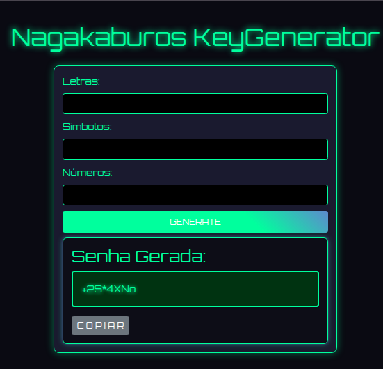
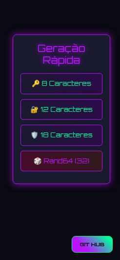

# NGKey Generator 🔐

Projeto desenvolvido no **Dia 5** do curso [100 Days of Code: The Complete Python Pro Bootcamp](https://www.udemy.com/course/100-days-of-code/) ministrado por Angela Yu.

## 💡 Sobre

O projeto começou com um script simples em Python que gerava senhas a partir de listas de letras, números e símbolos, solicitando os parâmetros via `input()`.

Com base nesse script inicial, a aplicação foi evoluída para uma aplicação web usando **Flask**, com suporte a:

* Interface web para entrada manual dos parâmetros (letras, símbolos e números)
* Geração de senhas automáticas via parâmetros na URL (`?length=12&mode=rand64`)
* Armazenamento temporário da senha na `session`
* Limpeza da senha via rota `/clear`
* Estilo HTML simples com `render_template`

## 🛠️ Tecnologias

* Python 3
* Flask
* HTML (via Jinja2)
* Biblioteca `secrets` para geração segura de senhas
* Deploy com Render.com

## 🔗 Projeto Final

Acesse a aplicação em:
👉 [https://ngkey-generator.onrender.com](https://ngkey-generator.onrender.com)

## 🖼️ Screenshots

### Tela Principal

### Área de Geração Manual

### Geração Rápida

